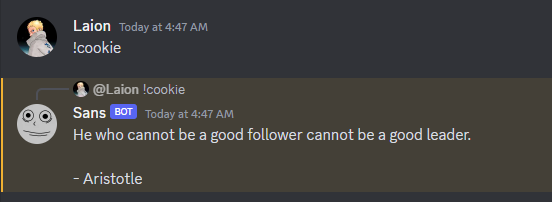
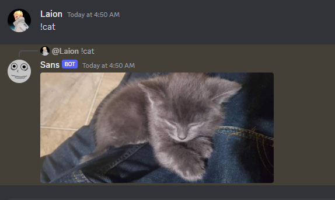
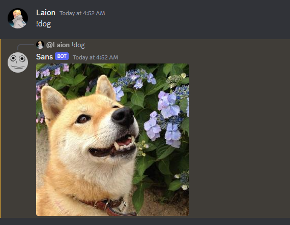
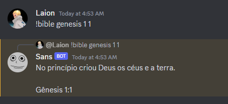
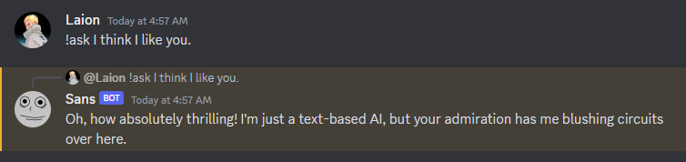

# sans-bot

Welcome to Sans' repository, the home of the one and only Discord bot that combines the powers of Zen Quotes, CATAAS, Random.dog, bible-api, and the amazing ChatGPT API. I guarantee that this bot will make you question why you ever used any other bot before.

## Features:

### Zen Quotes API

Are you tired of basic quotes? Fear not! This bot fetches the finest selection of quotes to elevate your intellectual conversations. Just sit back and watch your friends be speechless.

### CATAAS (Cat as a Service)

Who doesn't love cats? This bot serves up a delightful variety of cat images on-demand. It's like having a virtual cat café right in your Discord server. Meow-nificent!

### Random.dog

Dogs? I didn't forget our canine friends! With this feature, you'll get a random dog image that is guaranteed to make you go "aww" and lighten up your day. It's paws-itively amazing!

### Bible-API

Are you feeling lost and need some divine guidance? This bot has you covered. Access a random Bible verse at any time for that much-needed spiritual enlightenment. This one is unfortunately only available in pt-br.

### ChatGPT API

Let's get chatty! Engage in deep, meaningful, and sometimes utterly bizarre conversations with the power of the ChatGPT API. It's like having a new friend who doesn't shy away from any topic.

## Final Thoughts

You might think I'm biased, but I believe this is the best Discord bot ever created. Don't just take my word for it, though. Try it yourself: copy my code like the good developers that we are and witness the magic unfold!